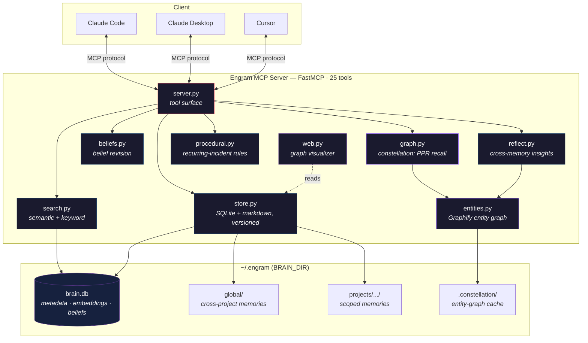

<div align="center">

```
┌─────────────────────────────────────────────┐
│                                             │
│              ◉  E N G R A M  ◉              │
│                                             │
│    Persistent memory for AI workflows       │
│                                             │
└─────────────────────────────────────────────┘
```

**Your AI forgets everything between sessions. Engram fixes that.**

Persistent memory + semantic search as an MCP server.\
Works with Claude Code, Claude Desktop, Cursor, and any MCP-compatible editor.

[](https://python.org)
[](https://modelcontextprotocol.io)
[](LICENSE)
[](https://engram.eliacinti.dev)

**[Live graph demo →](https://engram.eliacinti.dev)** &nbsp;·&nbsp; *(coming soon — explore a real brain as an interactive constellation)*

</div>

---

## The Problem

Every time you open Claude Code on a project, it starts from zero. It re-reads files, re-analyzes architecture, re-discovers patterns — burning tokens and time on things it already figured out yesterday.

You end up repeating yourself:
> *"Remember, we're using the observer pattern here..."*\
> *"The deploy script needs the --feynotes flag..."*\
> *"We already tried that approach, it doesn't work because..."*

## The Solution

Engram gives your AI a **persistent brain** — a local knowledge base where it stores insights, decisions, and patterns, then retrieves them instantly at the start of every session.

One tool call at session start. All relevant context loaded. Zero wasted tokens re-discovering.

---

## Features

**Persistent Memory** — Knowledge stored as markdown files with SQLite metadata. Survives across sessions, searchable, human-readable.

**Semantic Search** — Finds memories by meaning, not just keywords. Ask for "linearizzazione sistemi" and it finds your notes on equilibrium points, even if the word "linearizzazione" never appears in them. Powered by local embeddings via [fastembed](https://github.com/qdrant/fastembed) — no API calls, no costs, runs on your machine.

**Project Profiles** — Register your projects with their filesystem paths. Engram auto-detects which project you're in and scopes memories accordingly. Your FeyNotes memories stay separate from your LaPlacebo memories.

**Auto-Context** — `get_context` is the killer tool: one call at session start that detects the project, gathers relevant memories, loads recent decisions, and returns everything your AI needs to hit the ground running.

**Decision Log** — Not just *what* you know, but *what you decided and why*. When a future session faces the same choice, it sees the rationale and the rejected alternatives — no more re-debating solved problems.

**Constellation — Graph-Aware Recall** — Plain `recall` is pure cosine top-k, so a memory that's strongly *connected* to your query but not textually similar never surfaces. Engram builds a weighted graph over your brain from **citation** edges (`"memoria #82"`, `"aggiorna #77"` parsed from the prose), **semantic** k-NN edges, and **shared-entity** edges, then runs HippoRAG-style spreading activation (Personalized PageRank). `recall_associative` pulls up neighbours of your best hits even when their raw similarity is low — and returns the plain-cosine baseline alongside, so you can compare.

**Entity Knowledge Graph (Graphify)** — Extracts the entities inside your notes (`convert.py`, `Di Gennaro`, `Opus 4.8`) and the relations between them, linking memories that mention the same thing even when neither cites the other. Extraction runs through the **local `claude` CLI** — it uses your Claude plan, not metered API, so it costs **$0** — and degrades gracefully when not installed.

**Belief Revision** — A plain store treats every memory as true forever; a brain shouldn't. `review_beliefs` does a read-only pass that flags memories likely gone stale — superseded by a newer note, past a temporal deadline (`"resets 1 Jul"`), or provisional/fallback wording — and annotates them in `recall` instead of silently trusting them. It never deletes: it suggests, you confirm with `flag_stale` / `set_belief`. Every update is **non-destructive**, so prior versions stay recoverable via `memory_history`.

**Reflection & Insights** — The brain thinks *between* sessions. `reflect` combines memories to surface cross-project analogies and non-obvious connections that no single memory holds — reusing the entity graph it already built, so no extra LLM cost. Candidates are *proposed*, never auto-trusted: you `accept_insight` (promoted to a real linked memory) or `reject_insight`.

**Procedural Memory** — Recency-ranked recall can *hide* the right rule and let you repeat a mistake twice. `review_procedures` clusters recurring incident memories by root theme and proposes a single always-on rule for review — human-in-the-loop, it never rewrites your operating instructions itself.

---

## Architecture



---

## Quick Start

### 1 · Install

```bash
git clone https://github.com/eliacinti/engram.git
cd engram

# Base install (keyword search only)
pip install -e .

# Recommended: with semantic search (~200MB model, runs locally)
pip install -e ".[semantic]"
```

### 2 · Connect to Claude Code

```bash
claude mcp add engram -- python /absolute/path/to/engram/engram/server.py
```

<details>
<summary>Manual configuration (Claude Code / Desktop / Cursor)</summary>

**Claude Code** — `~/.claude.json` or project-level `.mcp.json`:
```json
{
  "mcpServers": {
    "engram": {
      "command": "python",
      "args": ["/absolute/path/to/engram/engram/server.py"],
      "env": {
        "BRAIN_DIR": "/Users/you/.engram"
      }
    }
  }
}
```

**Claude Desktop** — `~/Library/Application Support/Claude/claude_desktop_config.json`:
```json
{
  "mcpServers": {
    "engram": {
      "command": "python",
      "args": ["/absolute/path/to/engram/engram/server.py"]
    }
  }
}
```

**Cursor** — `.cursor/mcp_servers.json`:
```json
{
  "mcpServers": {
    "engram": {
      "command": "python",
      "args": ["/absolute/path/to/engram/engram/server.py"]
    }
  }
}
```

</details>

### 3 · Register a project

In your first Claude session with Engram connected:

```
Register my project "feynotes" with description "Lecture audio to interactive web pages"
and path "/Volumes/ExtremeSSD/University/Lecture_From_Audio/"
```

### 4 · Use it

From now on, every session can start with `get_context` and your AI already knows what's going on. As you work, important discoveries get stored automatically. Over time, the brain compounds — each session is smarter than the last.

---

## Tools

Engram exposes **25 MCP tools**, grouped by area.

**Memory**

| Tool | What it does |
|:-----|:-------------|
| `store_memory` | Save an insight, pattern, fix, or reference for future sessions. |
| `get_memory` | Load the full content of a specific memory by ID. |
| `list_memories` | Browse all memories. Filter by project or category. |
| `update_memory` | Modify a memory's content or tags — non-destructive, prior versions kept. |
| `delete_memory` | Permanently remove a memory. |
| `memory_history` | Show prior versions of a memory (preserved on every update). |

**Search & Context**

| Tool | What it does |
|:-----|:-------------|
| `get_context` | **Start here.** Auto-detects project, returns relevant memories + decisions + stats + what needs review. |
| `recall` | Semantic (or keyword) search across stored knowledge, annotated with belief status. |
| `brain_status` | Health check, search mode, stats, and registered projects. |

**Decisions**

| Tool | What it does |
|:-----|:-------------|
| `store_decision` | Log a decision with rationale and rejected alternatives. |
| `list_decisions` | Browse the decision history. |

**Projects**

| Tool | What it does |
|:-----|:-------------|
| `register_project` | Map filesystem paths to a project name for auto-detection. |
| `list_projects` | Show all registered projects. |

**Constellation — Graph**

| Tool | What it does |
|:-----|:-------------|
| `recall_associative` | Spreading-activation recall over the memory graph (HippoRAG-style PPR); returns the cosine baseline too. |
| `related_memories` | Show the memories most strongly linked to a given one (typed neighbours). |
| `memory_graph` | Graph overview: hubs, orphans, components, a Mermaid backbone + the entity graph. |
| `rebuild_entity_graph` | (Re)build the Graphify entity knowledge graph via the local `claude` CLI ($0). |

**Belief Revision**

| Tool | What it does |
|:-----|:-------------|
| `review_beliefs` | Read-only scan for memories likely gone stale (superseded / temporal / provisional). |
| `set_belief` | Update a memory's belief envelope: confidence, status, validity, supersession. |
| `flag_stale` | Mark a memory stale — kept and recoverable, but annotated in recall. |

**Reflection & Insights**

| Tool | What it does |
|:-----|:-------------|
| `reflect` | Surface cross-project analogies and non-obvious connections as *proposed* insights. |
| `list_insights` | List reflection insights by status (proposed / accepted / rejected). |
| `accept_insight` | Accept an insight and promote it to a real memory linked to its sources. |
| `reject_insight` | Reject an insight (kept on record, marked rejected). |

**Procedural Memory**

| Tool | What it does |
|:-----|:-------------|
| `review_procedures` | Cluster recurring incidents and propose always-on rules for review (read-only). |

### Memory Categories

| Category | Use for |
|:---------|:--------|
| `architecture` | System design, structure, high-level patterns |
| `bugfix` | Bugs found and their solutions |
| `config` | Setup details, environment variables, infrastructure |
| `pattern` | Code conventions, recurring patterns, style rules |
| `context` | General project background and context |
| `reference` | API details, library usage, external documentation |
| `note` | Everything else |

---

## Storage

All data lives locally in `~/.engram` (configurable via `BRAIN_DIR` env var):

```
~/.engram/
├── brain.db                    # SQLite: metadata + cached embeddings
├── global/                     # Cross-project knowledge
│   ├── python-venv-tips.md
│   └── git-workflow.md
└── projects/
    ├── feynotes/
    │   ├── pipeline-architecture.md
    │   ├── katex-gotchas.md
    │   └── deploy-workflow.md
    └── laplacebo/
        └── solver-design.md
```

Memories are plain markdown files with YAML frontmatter — readable and editable by hand.

---

## Search Modes

Engram ships with two search backends:

| Mode | Install | How it works | Speed |
|:-----|:--------|:-------------|:------|
| **Semantic** | `pip install fastembed` | Local embeddings + cosine similarity. Finds by meaning. | ~50ms |
| **Keyword** | Built-in | Token overlap scoring on title + tags + content. | ~5ms |

Semantic search runs entirely on your machine — no API calls, no cloud, no costs. The embedding model (`BAAI/bge-small-en-v1.5`, ~33M params) downloads once and runs locally.

---

## Recently shipped

- [x] **Constellation** — graph-aware associative recall (citation + semantic + entity edges, HippoRAG-style spreading activation)
- [x] **Graphify entity graph** — entity/relation extraction over the brain via the local `claude` CLI ($0)
- [x] **Belief revision** — stale / superseded / temporal flagging, annotated in recall, non-destructive
- [x] **Reflection & insights** — cross-memory analogies proposed for accept/reject
- [x] **Procedural memory** — recurring-incident clustering into candidate rules
- [x] **Non-destructive memory history** — every update preserves prior versions
- [x] **Web graph visualizer** — interactive constellation view *(live demo coming to [engram.eliacinti.dev](https://engram.eliacinti.dev))*

## Roadmap

- [ ] Auto-summarize old memories to reduce token usage
- [ ] Memory importance decay (surface recent and frequently-accessed memories first)
- [ ] Claude Code hooks for automatic context injection + brain backup on session stop
- [ ] Export/sync with Notion
- [ ] Conversation history indexing
- [ ] Multi-language embedding model for better Italian support

---

## Acknowledgments

Inspired by [mstrehse/mcp-brain](https://github.com/mstrehse/mcp-brain) — a Go-based MCP memory server that sparked the idea. Engram is a ground-up rewrite in Python with semantic search, project awareness, and auto-context injection.

## License

[MIT](LICENSE)

---

<div align="center">
<sub>Built by <a href="https://eliacinti.dev">Elia Cinti</a></sub>
</div>
