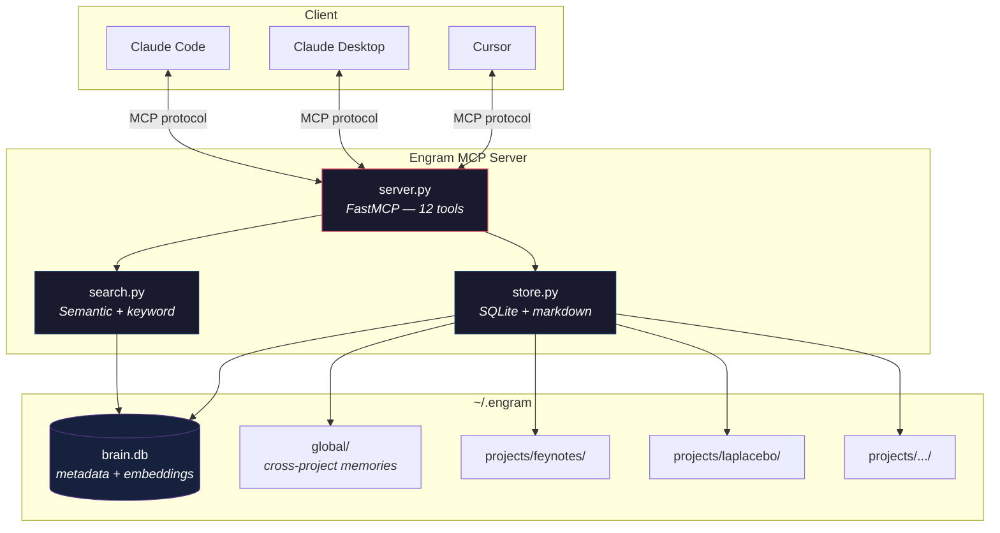

<div align="center">

```
┌─────────────────────────────────────────────┐
│                                             │
│              ◉  E N G R A M  ◉              │
│                                             │
│    Persistent memory for AI workflows       │
│                                             │
└─────────────────────────────────────────────┘
```

**Your AI forgets everything between sessions. Engram fixes that.**

Persistent memory + semantic search as an MCP server.\
Works with Claude Code, Claude Desktop, Cursor, and any MCP-compatible editor.

[](https://python.org)
[](https://modelcontextprotocol.io)
[](LICENSE)

</div>

---

## The Problem

Every time you open Claude Code on a project, it starts from zero. It re-reads files, re-analyzes architecture, re-discovers patterns — burning tokens and time on things it already figured out yesterday.

You end up repeating yourself:
> *"Remember, we're using the observer pattern here..."*\
> *"The deploy script needs the --feynotes flag..."*\
> *"We already tried that approach, it doesn't work because..."*

## The Solution

Engram gives your AI a **persistent brain** — a local knowledge base where it stores insights, decisions, and patterns, then retrieves them instantly at the start of every session.

One tool call at session start. All relevant context loaded. Zero wasted tokens re-discovering.

---

## Features

**Persistent Memory** — Knowledge stored as markdown files with SQLite metadata. Survives across sessions, searchable, human-readable.

**Semantic Search** — Finds memories by meaning, not just keywords. Ask for "linearizzazione sistemi" and it finds your notes on equilibrium points, even if the word "linearizzazione" never appears in them. Powered by local embeddings via [fastembed](https://github.com/qdrant/fastembed) — no API calls, no costs, runs on your machine.

**Project Profiles** — Register your projects with their filesystem paths. Engram auto-detects which project you're in and scopes memories accordingly. Your FeyNotes memories stay separate from your LaPlacebo memories.

**Auto-Context** — `get_context` is the killer tool: one call at session start that detects the project, gathers relevant memories, loads recent decisions, and returns everything your AI needs to hit the ground running.

**Decision Log** — Not just *what* you know, but *what you decided and why*. When a future session faces the same choice, it sees the rationale and the rejected alternatives — no more re-debating solved problems.

---

## Architecture



---

## Quick Start

### 1 · Install

```bash
git clone https://github.com/eliacinti/engram.git
cd engram

# Base install (keyword search only)
pip install -e .

# Recommended: with semantic search (~200MB model, runs locally)
pip install -e ".[semantic]"
```

### 2 · Connect to Claude Code

```bash
claude mcp add engram -- python /absolute/path/to/engram/engram/server.py
```

<details>
<summary>Manual configuration (Claude Code / Desktop / Cursor)</summary>

**Claude Code** — `~/.claude.json` or project-level `.mcp.json`:
```json
{
  "mcpServers": {
    "engram": {
      "command": "python",
      "args": ["/absolute/path/to/engram/engram/server.py"],
      "env": {
        "BRAIN_DIR": "/Users/you/.engram"
      }
    }
  }
}
```

**Claude Desktop** — `~/Library/Application Support/Claude/claude_desktop_config.json`:
```json
{
  "mcpServers": {
    "engram": {
      "command": "python",
      "args": ["/absolute/path/to/engram/engram/server.py"]
    }
  }
}
```

**Cursor** — `.cursor/mcp_servers.json`:
```json
{
  "mcpServers": {
    "engram": {
      "command": "python",
      "args": ["/absolute/path/to/engram/engram/server.py"]
    }
  }
}
```

</details>

### 3 · Register a project

In your first Claude session with Engram connected:

```
Register my project "feynotes" with description "Lecture audio to interactive web pages"
and path "/Volumes/ExtremeSSD/University/Lecture_From_Audio/"
```

### 4 · Use it

From now on, every session can start with `get_context` and your AI already knows what's going on. As you work, important discoveries get stored automatically. Over time, the brain compounds — each session is smarter than the last.

---

## Tools

| Tool | What it does |
|:-----|:-------------|
| `get_context` | **Start here.** Auto-detects project, returns relevant memories + recent decisions. |
| `recall` | Semantic search across all stored knowledge. |
| `store_memory` | Save an insight, pattern, fix, or reference for future sessions. |
| `get_memory` | Load the full content of a specific memory by ID. |
| `list_memories` | Browse all memories. Filter by project or category. |
| `update_memory` | Modify an existing memory's content or tags. |
| `delete_memory` | Permanently remove a memory. |
| `store_decision` | Log a decision with rationale and rejected alternatives. |
| `list_decisions` | Browse the decision history. |
| `register_project` | Map filesystem paths to a project name. |
| `list_projects` | Show all registered projects. |
| `brain_status` | Health check, stats, and diagnostics. |

### Memory Categories

| Category | Use for |
|:---------|:--------|
| `architecture` | System design, structure, high-level patterns |
| `bugfix` | Bugs found and their solutions |
| `config` | Setup details, environment variables, infrastructure |
| `pattern` | Code conventions, recurring patterns, style rules |
| `context` | General project background and context |
| `reference` | API details, library usage, external documentation |
| `note` | Everything else |

---

## Storage

All data lives locally in `~/.engram` (configurable via `BRAIN_DIR` env var):

```
~/.engram/
├── brain.db                    # SQLite: metadata + cached embeddings
├── global/                     # Cross-project knowledge
│   ├── python-venv-tips.md
│   └── git-workflow.md
└── projects/
    ├── feynotes/
    │   ├── pipeline-architecture.md
    │   ├── katex-gotchas.md
    │   └── deploy-workflow.md
    └── laplacebo/
        └── solver-design.md
```

Memories are plain markdown files with YAML frontmatter — readable and editable by hand.

---

## Search Modes

Engram ships with two search backends:

| Mode | Install | How it works | Speed |
|:-----|:--------|:-------------|:------|
| **Semantic** | `pip install fastembed` | Local embeddings + cosine similarity. Finds by meaning. | ~50ms |
| **Keyword** | Built-in | Token overlap scoring on title + tags + content. | ~5ms |

Semantic search runs entirely on your machine — no API calls, no cloud, no costs. The embedding model (`BAAI/bge-small-en-v1.5`, ~33M params) downloads once and runs locally.

---

## Roadmap

- [ ] Auto-summarize old memories to reduce token usage
- [ ] Memory importance decay (surface recent and frequently-accessed memories first)
- [ ] Claude Code hooks for automatic context injection
- [ ] Export/sync with Notion
- [ ] Conversation history indexing
- [ ] Web UI for browsing and managing the brain
- [ ] Multi-language embedding model for better Italian support

---

## Acknowledgments

Inspired by [mstrehse/mcp-brain](https://github.com/mstrehse/mcp-brain) — a Go-based MCP memory server that sparked the idea. Engram is a ground-up rewrite in Python with semantic search, project awareness, and auto-context injection.

## License

[MIT](LICENSE)

---

<div align="center">
<sub>Built by <a href="https://eliacinti.dev">Elia Cinti</a></sub>
</div>
